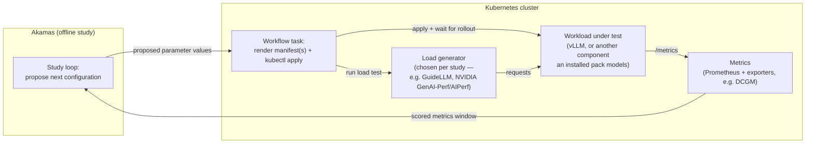

# vllm-benchmark

A home for **Akamas offline optimization studies** that tune AI inference workloads —
vLLM serving parameters, and the surrounding Kubernetes/GPU infrastructure Akamas can
also configure (e.g. container resource requests/limits) — on Kubernetes.

The repo's scope right now is deliberately narrow: **hold the studies, and hold the
Claude Code tooling that helps with the two things we're actively working on** —
generating correct Akamas configuration and analyzing study results. Provisioning the
underlying cluster/environment is not the current focus of this repo's tooling; each
study's own README records exactly what it ran against.

This repo is set up to be worked on **with Claude Code** as a persistent collaborator —
most of the "how" lives in machine-readable form (`CLAUDE.md`, skills, rules) rather than
in prose, so read [Working with Claude Code](#working-with-claude-code) below if that's
new to you.

## How it works, end to end



1. **Akamas** runs an *offline study*: a search loop that proposes a configuration for
   the component(s) under test (e.g. `vLLM.gpu_memory_utilization=0.87`, or a Kubernetes
   container's `cpu_limit`), applies it, waits for a result, and scores it — repeating
   for N experiments to search the parameter space.
2. Applying a configuration and getting a result is driven by an Akamas **workflow**,
   which runs as shell commands over SSH to a Kubernetes management host: render the
   relevant manifest(s) with the proposed values → `kubectl apply` → wait for rollout →
   run **that study's load generator** (the tool varies — this repo doesn't standardize
   on one) → wait for it to finish.
3. While the load test runs, **Prometheus** (or whatever telemetry provider that study
   uses) scrapes the workload's own metrics endpoint and, for GPU workloads, an exporter
   like NVIDIA's **DCGM exporter**. Akamas pulls the relevant window of these metrics
   back through a telemetry instance and computes the trial's score.
4. The study's **goal** (e.g. maximize throughput subject to a latency SLO) decides
   which configuration "wins". Findings get written into that study's own `README.md`
   and, where they generalize, into the root `ROADMAP.md` — so the next study builds on
   them instead of starting cold.

## Repository layout

```
CLAUDE.md              Short contract for AI-assisted work in this repo: layout, Akamas
                        version, key commands, working rules. Read this first if you're
                        an agent (or a human) picking up the project.
ROADMAP.md              Living plan: open hypotheses that cut across studies, a
                        prioritized study backlog, and consolidated learnings. This is
                        the source of truth for "what should we try next" — update it as
                        studies complete, don't let it go stale.

studies/                One folder per study — see "Studies are self-contained" below.
  README.md             Recap index across all studies: folder, status, how it was
                        configured, what was observed — one row per study, one line per
                        cell. Maintained by /new-study and study-recap, not by hand.
  _TEMPLATE/            The folder shape every study starts from (README + akamas/ + k8s/
                        + results/ skeleton). Copied by /new-study, never run itself.
  <study-name>/         A real study: its own Akamas resources, its own Kubernetes
                        manifests, its own raw results, its own README.md.

knowledge/              Distilled notes on inference-tuning knowledge, shared across all
                        studies — papers, articles, blog posts, vendor docs alike; never
                        raw source material straight into a study. See knowledge/README.md.
  notes/                One .md file per distilled source, using notes/_TEMPLATE.md's
                        fixed fields (problem, levers, results, implications, which
                        Akamas parameters to explore).
  sources/              Raw source material (papers, HTML dumps, etc.) referenced by
                        notes/, kept only when a durable local copy is actually useful.

.claude/
  skills/
    study-recap/        Procedure for closing out a finished study: pull its data, write
                        studies/<study>/README.md, update studies/README.md and ROADMAP.md.
                        Akamas YAML generation (system/component/telemetry/workflow/study)
                        and optimization-pack work are handled by the akamas-study-manager
                        and akamas-optimization-pack plugins, not a local skill.
  commands/
    new-study.md        `/new-study` — scaffolds studies/<name>/ from studies/_TEMPLATE/
                        (asks for objective, target components, and load generator).
    log-results.md      `/log-results` — invokes the study-recap skill.
    update-knowledge.md `/update-knowledge` — distills a paper/article/doc into
                        knowledge/notes/ and updates its index.
  rules/
    akamas-yaml.md      Path-scoped conventions enforced on studies/**/akamas/** (naming,
                        the `kind` key, secrets, validation before declaring work done).
```

### Studies are self-contained, on purpose

Each study under `studies/<name>/` carries its **entire** setup — Akamas system,
component(s), telemetry instance, workflow, and study definition, plus whatever
Kubernetes manifests it applies (the workload under test, the load-test job, any
study-specific monitoring) — even when that means duplicating near-identical YAML
across studies. A study should be understandable and rerunnable on its own, without
having to reconstruct context from a different study or from a shared, evolving
`akamas/`/`k8s/` tree. The one thing *not* duplicated per study is the underlying
cluster/environment itself (out of this repo's current focus — see above); a study's
README records what it ran against regardless of where that cluster was provisioned.

**Optimization packs are managed outside this repo.** Which component types, parameters,
and metrics exist (vLLM, Kubernetes, GPU, or anything else Akamas has a pack for) is
decided by whoever administers the Akamas platform, not by editing files here — pack
lifecycle work happens via the `akamas-optimization-pack` plugin against the pack's own
repo (e.g. <https://gitlab.com/akamas/optimization-packs/vllm> for vLLM). A study only
*consumes* already-installed packs.

## Working with Claude Code

This repo is structured so an AI agent (or a human) can pick it up cold and know what to
do next:

1. **Read `CLAUDE.md`** — the short, stable contract: repo layout, the Akamas version
   this project targets, key CLI commands, and pointers to everything below.
2. **Before planning a new study, read `ROADMAP.md`** (cross-study hypotheses and
   prioritized backlog — what to try next) **and `studies/README.md`** (recap of what's
   already been built and found). Don't re-derive either from scratch each time.
3. **Never hand-write Akamas YAML** — use the `akamas-study-manager` plugin
   (`/akamas-study-manager:build`). It encodes the correct build order (System →
   Component → Telemetry → Workflow → Study, on top of whatever optimization packs are
   already installed), resolves the referenced pack directly from its own repo, and
   cross-checks the live Akamas docs rather than trusting a stale local snapshot. To
   scaffold or extend an optimization pack itself, use the sibling
   `akamas-optimization-pack` plugin (`/akamas-optimization-pack:build`) instead — though
   this repo's packs are managed outside this repo (see `CLAUDE.md`).
4. **Use `/new-study`** to scaffold a new, self-contained study folder, and
   **`/log-results`** (or the `study-recap` skill directly) once a study finishes — this
   keeps `ROADMAP.md`, `studies/README.md`, and each study's own `README.md` in sync
   with what's actually been tried, instead of that knowledge living only in someone's
   head or a chat transcript.
5. **Distill, don't dump**: if you read a paper, article, blog post, or vendor doc that
   should inform tuning, run **`/update-knowledge`** rather than pasting the source into
   a prompt or a study — it writes a short note in `knowledge/notes/` and updates the
   index for you.

## Current status

The `studies/` structure and Claude Code tooling described above are in place; no real
study has been scaffolded into it yet. See `ROADMAP.md`'s "Debt / non-study actions" for
outstanding items, including a security item (a private SSH key was committed to this
repo's git history in an earlier revision and needs revoking).
